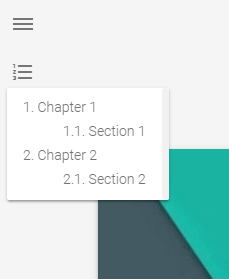
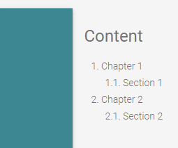

Modification of [hexo-material](https://github.com/viosey/hexo-theme-material) for personal use.

## Main Contribution

- Solve conflicts with [hexo-reference](https://github.com/kchen0x/hexo-reference).
- Provide an optional side navigation toc at the right side of the post.
    + Orignial toc is unattractive and useless because you have to click a button, which is far from the post. The new optional toc is just along the right side of the post.
    + Original style: 
    + Optional new style: 
    + Edit \_config.yml to enable this feature (enabled by default in \_config.template.yml).

            toc:
                sidenav: true

- Indent paragraphs.